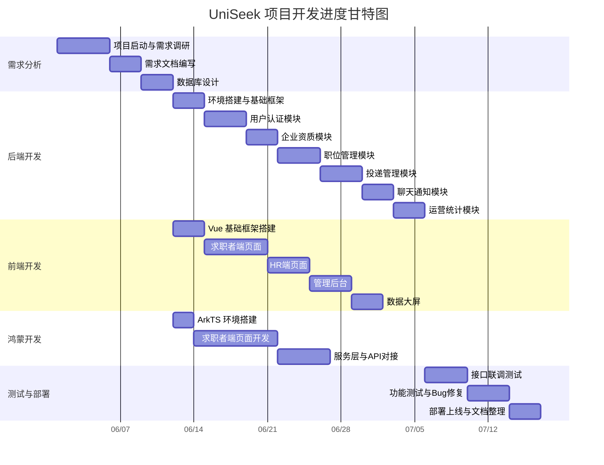

# UniSeek 优寻兼职招聘平台 · 项目实训报告

> **班级**：XXXXX  
> **姓名**：XXXXX  
> **学号**：xxxxxxxx  
> **日期**：2026年7月

---

# 第二章 项目阶段-前言

## 2.1 项目背景

### 项目起源（痛点）

大学生兼职市场长期存在严重的信息不对称问题。一方面，求职者（尤其是高校学生）难以找到真实可靠的兼职信息，时常遭遇虚假招聘、薪资拖欠等问题；另一方面，企业HR缺乏高效、精准的招聘渠道，传统兼职平台存在虚假信息泛滥、沟通效率低下、管理流程不透明等痛点。现有的兼职招聘平台多面向社会人士，缺乏针对大学生群体的专属服务，且普遍缺少从投递到录用的全流程闭环管理。

基于此，项目团队决定从零开发**UniSeek优寻兼职招聘平台**，旨在通过技术手段解决上述痛点，为高校学生和企业搭建一座可信、高效的兼职招聘桥梁。

### 数据基础

项目数据库基于 **MySQL 8**，采用 `utf8mb4` 字符集以支持完整中文存储。数据库共设计 **14 张业务表**，涵盖平台运营全链路数据：

| 表名 | 功能说明 |
|------|---------|
| `user` | 用户表（含角色：求职者/企业HR/管理员/超级管理员） |
| `real_name_auth` | 实名认证表（身份证加密存储） |
| `resume` | 在线简历表（含全文索引） |
| `enterprise` | 企业信息表（含审核状态） |
| `category` | 职位分类表（两级树形，30条种子数据） |
| `region` | 行政区划表（省/市/区三级，3432条数据） |
| `task` | 职位表（含乐观锁版本号） |
| `task_application` | 投递申请表（含简历快照） |
| `chat_session` | 聊天会话表 |
| `chat_message` | 聊天消息表 |
| `notification` | 消息通知表 |
| `daily_statistics` | 日报统计表 |
| `operation_log` | 操作日志审计表 |
| `favorite` | 收藏表 |

### 平台定位

UniSeek 优寻定位于**面向高校学生的兼职招聘垂直平台**，打造"求职-投递-沟通-录用-结算"全流程闭环服务。平台采用多端覆盖策略，提供 **Web 端（Vue 3）**、**鸿蒙 App 端（ArkTS）** 双入口，后端统一由 **Java Spring Boot** 提供 API 支撑。

### 驱动需求

项目的开发由四个核心需求驱动：

1. **信息真实**——建立企业资质审核 + 实名认证双认证体系，从源头保障信息的真实性。
2. **沟通高效**——求职者投递后自动创建聊天会话，HR 与求职者即时沟通，无需交换联系方式。
3. **流程透明**——投递状态全生命周期可追溯（已投递→待面试→已录用/已淘汰），各环节自动发送通知。
4. **数据驱动**——运营日报定时统计 + 数据大屏可视化，帮助运营团队实时掌握平台健康度。

### 服务对象与价值

| 服务对象 | 核心价值 |
|---------|---------|
| **求职者（高校学生）** | 获得真实可靠的兼职机会，从浏览到录用的全流程线上化 |
| **企业HR** | 精准触达高校求职者，高效管理招聘流程和投递记录 |
| **平台运营管理员** | 通过数据看板实时掌握平台运营状况，管理审核流程 |

---

## 2.2 系统概述

### 2.2.1 项目目标

#### 系统功能目标

系统应实现以下核心功能：

- **用户管理**：注册、登录、实名认证、个人信息管理、角色权限控制
- **企业认证**：企业资质提交、管理员审核、状态跟踪
- **职位管理**：发布、审核、搜索、筛选、状态自动变更
- **简历管理**：创建、编辑、附件上传、简历快照
- **投递管理**：投递申请、状态流转（HR侧+求职者侧双视角）
- **即时通讯**：点对点聊天、会话管理
- **消息通知**：系统自动通知（投递/面试/录用/淘汰）
- **数据可视化**：运营统计看板、数据大屏
- **系统管理**：用户管理、操作日志审计、定时任务

#### 性能/质量目标

| 维度 | 目标 |
|------|------|
| 系统稳定性 | 服务可用性 ≥ 99.9%，异常统一处理 |
| 响应速度 | 核心接口响应 ≤ 500ms，列表分页 ≤ 1s |
| 可维护性 | 代码分层清晰（Controller/Service/DAO），统一异常处理，完善日志审计 |
| 安全性 | 密码独立盐值 MD5 加密，JWT 无状态鉴权，身份证 AES 加密存储，RBAC 角色权限控制 |
| 数据一致性 | 乐观锁防止超录，幂等保护防止重复投递 |

#### 用户/服务目标

- **求职者**：快速发现合适的兼职岗位，一键投递，实时沟通，跟踪投递进度
- **企业HR**：高效管理招聘流程，查看投递简历，筛选合适人才，安排面试
- **运营管理员**：通过数据监控平台运营状况，管理企业资质审核和职位审核

#### 技术/架构目标

- **架构**：前后端分离架构，后端提供 RESTful API，前端独立部署
- **后端**：Java 1.8 + Spring Boot 2.2.2 + MyBatis + MySQL 8
- **前端**：Vue 3 + TypeScript + Vite + Element Plus + Pinia + ECharts
- **鸿蒙端**：ArkTS 6.1.1 + HarmonyOS NEXT 独立 App
- **接口规范**：统一 JSON 响应格式，统一错误码体系，统一鉴权机制

#### 交付/成果目标

- 一个可运行的**兼职招聘网站**（Vue 前端 + Java 后端 API）
- 一个**鸿蒙原生求职 App**（ArkTS）
- 一个**数据可视化大屏**（ECharts + 实时数据）
- 一套完整的**设计系统**（CSS 变量 + Token 体系，横跨三端）

### 2.2.2 功能模块概述

| 模块/功能名称 | 职责描述 |
|--------------|---------|
| 用户注册模块 | 支持手机号+邮箱双标识注册，选择求职者/HR身份，密码MD5+独立盐值加密 |
| 用户登录模块 | 手机号+密码登录，JWT Token 30分钟有效期，按角色路由到不同首页 |
| JWT鉴权与权限控制模块 | Token校验+角色权限拦截，白名单路径放行，ThreadLocal存储用户信息 |
| 实名认证模块 | 身份证校验（Hutool IdcardUtil）+年龄验证（≥16周岁），AES加密存储 |
| 企业资质提交模块 | HR提交公司全称、信用代码、营业执照图片，待管理员审核 |
| 企业资质状态查询模块 | HR随时查看审核进度（待审/已认证/已驳回） |
| 企业资质修改模块 | 驳回后可修改信息重新提交，状态重置为待审 |
| 管理员审核企业资质模块 | 运营管理员审核/驳回企业资质，通知HR审核结果 |
| 简历创建与编辑模块 | 求职者在线简历填写（性别/学历/学校/技能/经历），支持附件上传 |
| 简历附件上传模块 | PDF/Word格式，10MB限制，存储到文件系统 |
| 职位分类浏览模块 | 两级树形分类（15个顶级+15个子级），级联选择器 |
| 行政区划浏览模块 | 省/市/区三级渐进加载，3432条GB/T 2260标准数据 |
| 职位发布模块 | HR发布兼职职位，填写标题/描述/薪资/分类/地区/名额等信息 |
| 职位审核模块 | 运营管理员审核/驳回职位，通过后对求职者可见 |
| 职位列表浏览与搜索模块 | 多维度筛选（分类/地区/薪资/类型/关键词），分页加载 |
| 职位状态自动变更模块 | 满员自动关闭（名额归零）、截止自动过期（定时任务）、HR手动下架 |
| 乐观锁防超录模块 | 版本号字段防并发超录，affected rows校验 |
| 投递职位模块 | 实名认证校验+简历快照+创建聊天会话+通知HR |
| 简历快照机制 | 投递时刻简历状态序列化存储，投递后修改不影响已投递记录 |
| 投递状态管理模块（HR侧） | 已投递→待面试→已录用/已淘汰/已完成，严格状态流转 |
| 投递状态查看模块（求职者侧） | 各状态标签展示（已投递/待面试/已录用/已淘汰等） |
| 消息通知模块 | 系统自动通知（投递提醒/面试邀请/录用通知/淘汰通知） |
| 即时聊天模块 | 投递后自动创建会话，WebSocket点对点通信 |
| 运营日报统计模块 | 每日00:05定时统计7项运营数据，幂等保护 |
| 操作日志审计模块 | AOP切面记录关键操作，只追加不修改不删除 |
| 管理员后台用户管理模块 | 用户列表/搜索/禁用/恢复/设管理员（超级管理员专属） |
| 管理员后台职位管理模块 | 全状态职位列表/筛选/下架违规职位 |
| 管理员后台统计看板模块 | 总览数据+趋势折线图，按日期范围筛选 |
| 数据大屏可视化模块 | KPI总览+供需趋势+职位占比+地域流向+投递漏斗+热门岗位+实时动态 |
| 超级管理员账号管理模块 | 种子账号18688886666，不可禁用不可删除，拥有设管理员权限 |

### 2.2.3 项目预期成果

#### 产品层面成果

交付 **UniSeek 兼职招聘平台**，涵盖 Web 端 + 鸿蒙 App 端双入口，具备从用户注册到录用结算的全流程闭环能力。平台面向高校学生提供专属兼职招聘服务，形成了一套完整的"信息真实保障 + 即时沟通 + 流程透明 + 数据驱动"的服务体系。

#### 技术层面成果

采用**前后端分离 + 鸿蒙独立端**的三端架构：

- 后端采用**分层架构**（Controller / Service / DAO / Entity），职责清晰，可维护性强
- 前端 Vue 3 采用**组合式 API + Pinia 状态管理**，组件化程度高
- 鸿蒙端 ArkTS 严格遵循 **HarmonyOS NEXT 设计规范**，复用 HMOS 系统 Token
- 设计了一套**跨端 CSS 变量 + Token 体系**，在 Vue Admin / Vue 前端 / ArkTS 三端保持视觉统一
- 实现了**JWT 无状态鉴权 + RBAC 角色权限控制**，安全性得到保障
- 通过**乐观锁**解决了并发超录问题，通过**定时任务**实现了自动化运维
- **AOP 操作日志审计**和**统一异常处理**机制保证了系统的可追溯性和健壮性

#### 数据与业务层面成果

- 沉淀了 **14 张业务表**的企业级数据库设计，涵盖用户、企业、职位、投递、聊天、通知等全链路
- 验证了简历快照、投递状态机、运营日报等核心业务场景
- 积累了从需求分析到系统设计、编码实现、测试验证的完整工程经验

#### 社会价值与行业影响

UniSeek 为高校学生提供了安全、可信的兼职招聘入口，通过双认证体系降低求职风险，通过全流程线上化提升招聘效率。平台的设计理念和架构方案可为同类校园服务平台提供参考和借鉴。

---

## 2.3 相关工作计划安排

### 项目组成员

| 姓名 | 角色 |
|------|------|
| XXXXX | 项目经理 |
| XXXXX | 前端工程师 |
| XXXXX | 后端工程师 |

### 项目甘特图



### 项目组成员互评

| 学号 | 姓名 | 职责 | 评价 | 互评打分 |
|------|------|------|------|---------|
| xxxxxxxx | XXXXX | 项目经理 | 统筹项目整体进度，协调前后端联调，组织需求评审和代码审查，沟通积极主动，确保了项目按时交付 | 95 |
| xxxxxxxx | XXXXX | 前端工程师 | 完成Vue前端21个页面+鸿蒙端28个页面的开发，设计统一设计系统，实现数据大屏可视化，代码质量高，组件复用性强 | 94 |
| xxxxxxxx | XXXXX | 后端工程师 | 搭建Spring Boot后端框架，完成30个功能模块的API开发，数据库设计合理，接口规范清晰，性能优化到位 | 93 |

---

# 第三章 项目阶段-本人负责模块的需求分析

> **需求分析目标范围**：本章围绕本人负责的鸿蒙求职者端（ArkTS）、Vue数据大屏（Vue 3）以及后端系统（Java）三个维度的模块，分析其功能定位、数据基础、服务形式和面向的用户群体。

---

## 3.1 功能介绍

本人负责的模块覆盖了项目的三个技术端，各端的核心功能定位如下：

| 端 | 技术栈 | 面向用户 | 核心能力 |
|----|--------|---------|---------|
| **鸿蒙求职者端** | ArkTS 6.1.1 + HarmonyOS NEXT | 求职者（高校学生） | 职位浏览与搜索、职位投递、简历管理、即时聊天、收藏管理、个人中心 |
| **Vue 数据大屏** | Vue 3 + ECharts | 运营管理员 | KPI指标展示、供需趋势分析、职位占比分布、地域流向图、投递转化漏斗、实时动态 |
| **后端系统** | Java 1.8 + Spring Boot 2.2.2 | 全端（提供API支持） | 认证鉴权、业务数据处理、数据统计分析、文件上传、WebSocket通信、定时任务 |

---

## 3.2 基础信息管理

本人负责模块中涉及的基础数据管理包括：

| 数据类型 | 管理内容 | 支持操作 |
|---------|---------|---------|
| **用户管理** | 手机号、邮箱、密码、昵称、角色（0求职者/1HR/9管理员/99超级管理员）、状态 | 注册、登录、信息修改、密码修改、角色管理（超级管理员专属） |
| **简历管理** | 性别、出生日期、学历、学校、技能标签、工作经历（富文本）、附件简历 | 创建、编辑、附件上传、发布/取消发布到人才市场 |
| **分类管理** | 30条种子数据，两级树形结构（15顶级+15子级） | 查询树形结构（前端缓存，低频更新） |
| **地区管理** | 3432条三级行政区划（省/市/区县），GB/T 2260标准 | 三级渐进加载查询 |

---

## 3.3 业务办理及信息查询

### 求职端（鸿蒙 App + Vue Web）

| 业务功能 | 说明 |
|---------|------|
| **职位搜索与筛选** | 按分类、地区、薪资范围、岗位类型、关键词多维度搜索招聘中职位 |
| **投递申请** | 实名认证校验 → 简历快照 → 创建投递记录 → 创建聊天会话 → 通知HR |
| **面试管理** | 查看面试邀请（时间/地点），确认或反馈 |
| **录用确认** | 查看录用通知，确认到岗 |
| **即时聊天** | 与HR点对点沟通，发送文本/图片消息 |
| **收藏管理** | 收藏/取消收藏感兴趣的职位 |

### 管理端（Vue 后台 + 数据大屏）

| 业务功能 | 说明 |
|---------|------|
| **企业资质审核** | 查看待审企业详情，通过/驳回，记录驳回原因 |
| **职位审核** | 查看待审职位详情，通过/驳回/下架 |
| **用户管理** | 查看用户列表，禁用/恢复用户，超级管理员可设管理员 |
| **数据统计查询** | 按日期范围查询运营数据，查看累计数据和趋势 |
| **操作日志审计** | 按操作人/类型/时间筛选，查询不可修改的历史记录 |

---

## 3.4 实时数据采集与显示

数据大屏模块负责实时统计和可视化展示平台运营数据：

| 数据指标 | 呈现形式 | 说明 |
|---------|---------|------|
| KPI 总览 | 指标卡片（数字+趋势箭头） | 累计用户、认证企业、招聘中职位、投递总数 |
| 供需趋势 | 折线图 | 近7天每日新增用户/职位/投递/面试/入职趋势 |
| 职位大类占比 | 环形图 | 各职位分类的岗位数量占比 |
| 全国岗位流向 | 地域流向图 | 各省份岗位需求分布与人才流向 |
| 投递转化漏斗 | 进度条 | 已投递→待面试→已录用→已完成各阶段数量 |
| 企业资质审核 | 进度条 | 待审核/已认证/已驳回企业数量分布 |
| 实名认证率 | 进度条 | 已认证用户占比 |
| 热门岗位 TOP10 | 列表 | 投递量最高的10个岗位 |
| 实时动态 | 时间线列表 | 最新的用户注册、企业认证、职位发布等动态 |

数据来源：后端 `daily_statistics` 日报统计表（每日00:05定时汇总） + 各业务表实时聚合查询。

---

## 3.5 示例用例

### UC1：求职者投递职位

| 项目 | 内容 |
|------|------|
| **用例名称** | 求职者投递职位 |
| **参与者** | 求职者（已登录） |
| **前置条件** | 已完成实名认证，已创建在线简历，目标职位处于"招聘中"状态 |
| **后置条件** | 投递记录创建成功，聊天会话自动创建，HR收到系统通知 |
| **主要成功场景** | ① 求职者浏览职位列表，点击感兴趣的职位进入详情页 → ② 点击"投递"按钮 → ③ 系统校验实名认证状态（已认证则继续） → ④ 系统校验职位状态（招聘中、未过期、有剩余名额） → ⑤ 系统校验未重复投递 → ⑥ 系统读取当前简历数据，创建简历快照 → ⑦ 系统插入投递记录（status=0 已投递） → ⑧ 系统自动创建聊天会话（关联该投递记录） → ⑨ 系统向HR发送"新投递提醒"通知 → ⑩ 前端跳转到"我的投递"页面，显示"已投递"状态 |

### UC2：HR 审核投递

| 项目 | 内容 |
|------|------|
| **用例名称** | HR审核求职者投递 |
| **参与者** | 企业HR（已登录） |
| **前置条件** | 有求职者投递了该HR发布的职位 |
| **后置条件** | 投递状态变更，求职者收到对应类型的通知 |
| **主要成功场景** | ① HR进入简历池页面，查看某职位下的投递列表 → ② 点击某条投递记录，查看简历快照 → ③ 选择审核操作：邀请面试（填写面试时间地点）→ 系统状态更新为"待面试（1）"→ 发送面试邀请通知；或淘汰（填写淘汰原因）→ 系统状态更新为"已淘汰（4）"→ 发送淘汰通知 → ④ 对于待面试的记录，面试后可操作：录用（扣减名额，发送录用通知）或淘汰 |

### UC3：运营管理员审核企业资质

| 项目 | 内容 |
|------|------|
| **用例名称** | 运营管理员审核企业资质 |
| **参与者** | 运营管理员（role ≥ 9） |
| **前置条件** | 有企业HR提交了企业资质（audit_status=0） |
| **后置条件** | 企业资质状态变更，HR收到审核结果通知 |
| **主要成功场景** | ① 管理员进入企业资质审核页面 → ② 查看待审企业列表（按提交时间倒序） → ③ 点击某条记录进入详情页 → ④ 查看企业完整信息（公司全称、信用代码、营业执照图片等） → ⑤ 审核通过：点击"通过"→ 状态更新为已认证(1)→ 通知HR"资质已通过"；审核驳回：填写驳回原因 → 状态保持待审(0)→ 通知HR"审核未通过，原因：[驳回原因]" |

---

# 第四章 项目阶段-本人负责模块的详细设计

## 4.1 模块概述

本人负责的模块由以下部分组成：

| 模块 | 构成 | 简要职责 |
|------|------|---------|
| **鸿蒙求职者端** | 28个页面 + 28个组件 + 20个Service + 9个公共模块 | 求职者完整的求职体验，包括职位浏览、搜索筛选、投递申请、简历管理、即时聊天、收藏、个人中心等 |
| **Vue 数据大屏** | Dashboard 工作台 + ScreenPreview 大屏页面 | 运营数据可视化展示，KPI指标、趋势图、饼图、地域流向、转化漏斗 |
| **Java 后端** | 认证模块 + 用户模块 + 企业模块 + 职位模块 + 投递模块 + 聊天模块 + 通知模块 + 统计模块 + 日志模块 | 为所有端提供统一 RESTful API，处理业务逻辑、数据持久化、鉴权控制 |
| **样式设计系统** | CSS 变量（Vue）+ AppStyles Token（ArkTS）+ Admin 主题（Vue Admin） | 统一品牌色 #1762FB，间距/圆角/阴影/动画系统三端对齐 |

### 鸿蒙求职者端架构图

```
ets/
├── entryability/         # 应用入口 Ability
├── pages/                # 28个页面（Tab页+功能页）
│   ├── tab/seeker/       # 求职者 Tab 页（首页/聊天/个人中心）
│   ├── tab/recruiter/    # 招聘方 Tab 页（首页/聊天/个人中心）
│   ├── JobDetailPage.ets # 职位详情
│   ├── SearchPage.ets    # 搜索
│   ├── ResumePage.ets    # 简历管理
│   ├── ChatDetailPage.ets# 聊天详情
│   └── ...               # 其他功能页
├── components/           # 28个可复用组件
│   ├── job/              # 职位卡片、Feed卡片
│   ├── chat/             # 聊天相关（气泡/输入栏/会话列表）
│   ├── filter/           # 筛选组件（芯片/选择器/底部Sheet）
│   └── common/           # 空状态、错误视图、加载更多
├── services/             # 20个Service（API调用+数据管理）
│   ├── ApiClient.ets     # HTTP客户端封装
│   ├── AuthService.ets   # 认证服务
│   ├── ResumeService.ets # 简历服务
│   ├── ChatService.ets   # 聊天服务
│   └── ...               # 其他服务
└── common/               # 公共模块（样式常量/业务策略/表单校验）
```

### Vue 数据大屏架构

```
src/
├── pages/
│   ├── admin/
│   │   └── Dashboard.vue     # 后台工作台（统计总览+待办事项）
│   └── ScreenPreview.vue     # 数据大屏（完整可视化页面）
├── api/
│   └── admin.ts              # 管理后台API（统计/企业审核/职位审核/用户管理/日志）
├── styles/
│   ├── style.css             # 全局CSS变量（设计系统）
│   └── admin-theme.css       # Admin专属样式
```

### Java 后端（涉及模块）

```
com.uniseek/
├── auth/service/         # 认证服务（注册/登录/实名认证）
├── controller/           # 控制器
│   ├── AuthController.java
│   ├── ResumeController.java
│   ├── TaskController.java
│   └── ApplicationController.java
├── admin/controller/     # 管理后台控制器
│   ├── AdminStatisticsController.java
│   └── AdminTaskController.java
├── service/              # 业务服务层
├── dao/                  # 数据访问层
└── entity/               # 实体类
```

---

## 4.2 功能设计

### 4.2.1 鸿蒙求职者端核心功能

#### 职位浏览与搜索

| 项目 | 内容 |
|------|------|
| **功能描述** | 求职者可以在首页浏览推荐职位列表，通过搜索页输入关键词搜索职位，使用筛选器按分类、地区、薪资、岗位类型等维度筛选 |
| **业务逻辑** | 首页加载时调用 `DataService.getTaskList()` 获取招聘中职位列表（status=1），支持分页下拉加载。搜索页调用 `DataService.searchTasks()` 传递关键词和筛选参数。筛选组件使用FilterSheet底部弹出面板，选择条件后重新请求数据 |

#### 投递申请

| 项目 | 内容 |
|------|------|
| **功能描述** | 求职者在职位详情页点击投递按钮，完成投递申请 |
| **业务逻辑** | 点击投递 → 调用 `AuthService.checkRealName()` 校验实名认证 → 认证通过后调用 `ApplicationService.deliver()` → 后端创建投递记录（含简历快照）→ 自动创建聊天会话 → 发送通知至HR |

#### 即时聊天

| 项目 | 内容 |
|------|------|
| **功能描述** | 求职者与HR进行点对点即时通讯，支持文本和图片消息 |
| **业务逻辑** | 消息列表加载会话列表（`ChatService.getSessionList()`），点击进入聊天页加载最近20条消息（`ChatService.getMessages()`），上拉加载更多。发送消息通过 `ChatWebSocketService` 的 WebSocket 连接实时推送 |

### 4.2.2 Vue 数据大屏核心功能

#### KPI 指标展示

| 项目 | 内容 |
|------|------|
| **功能描述** | 大屏顶部展示4项核心KPI指标：累计用户、认证企业、招聘中职位、投递总数，并显示较昨日增减趋势 |
| **业务逻辑** | 调用 `getScreenSummary()` 接口获取汇总数据，前端按时间范围参数（24h/7d/30d/12m/10y）请求不同粒度的数据 |

#### 供需趋势折线图

| 项目 | 内容 |
|------|------|
| **功能描述** | 展示选定时间范围内每日新增用户、新增职位、新增投递等趋势曲线 |
| **业务逻辑** | 调用 `getScreenSummary()` 获取 `dailyList` 数组，使用 ECharts 折线图渲染，X轴为日期，Y轴为数量，多系列对比 |

#### 投递转化漏斗

| 项目 | 内容 |
|------|------|
| **功能描述** | 展示从投递到完成的全流程转化数据，以进度条形式呈现各阶段数量 |
| **业务逻辑** | 调用 `getApplicationFunnel()` 接口获取各状态计数，使用 CSS 进度条模拟漏斗视觉效果，计算各阶段转化率 |

### 4.2.3 Java 后端核心功能

#### 认证鉴权

| 项目 | 内容 |
|------|------|
| **功能描述** | 处理用户注册、登录、实名认证请求，生成和校验 JWT Token |
| **业务逻辑** | 注册时生成独立盐值，MD5加密存储密码；登录时比对密码，生成JWT Token（payload含用户ID和角色），有效期30分钟；实名认证使用Hutool校验身份证格式和年龄 |

#### 投递业务

| 项目 | 内容 |
|------|------|
| **功能描述** | 处理求职者的投递请求，创建投递记录和相关数据 |
| **业务逻辑** | 校验实名认证 → 校验职位状态 → 校验防重复投递 → 读取简历创建快照 → 插入投递记录（status=0）→ 创建聊天会话 → 发送通知给HR |

---

## 4.3 数据库设计

### 4.3.1 user 表（用户表）

| 字段名 | 类型 | 约束 | 说明 |
|--------|------|------|------|
| id | BIGINT(20) | PK, AUTO_INCREMENT | 用户ID |
| phone | VARCHAR(11) | UNIQUE, NOT NULL | 手机号（登录账号） |
| email | VARCHAR(100) | UNIQUE, NOT NULL | 邮箱 |
| password | VARCHAR(64) | NOT NULL | 密码（MD5+盐加密） |
| salt | VARCHAR(32) | NOT NULL | 随机盐值 |
| nickname | VARCHAR(50) | DEFAULT NULL | 昵称 |
| avatar_url | VARCHAR(255) | DEFAULT NULL | 头像URL |
| role | TINYINT(1) | NOT NULL, DEFAULT 0 | 角色：0求职者/1HR/9管理员/99超级管理员 |
| credit_score | INT(10) | NOT NULL, DEFAULT 100 | 信用积分 |
| status | TINYINT(1) | NOT NULL, DEFAULT 1 | 状态：0禁用/1正常 |
| last_login_time | DATETIME | DEFAULT NULL | 最后登录时间 |
| create_time | DATETIME | NOT NULL, DEFAULT CURRENT_TIMESTAMP | 创建时间 |
| update_time | DATETIME | NOT NULL, DEFAULT CURRENT_TIMESTAMP ON UPDATE | 更新时间 |

**索引**：`uk_phone`（唯一）、`uk_email`（唯一）、`idx_role`

### 4.3.2 resume 表（在线简历表）

| 字段名 | 类型 | 约束 | 说明 |
|--------|------|------|------|
| id | BIGINT(20) | PK, AUTO_INCREMENT | 简历ID |
| user_id | BIGINT(20) | UNIQUE, FK→user | 用户ID（1:1关系） |
| gender | TINYINT(1) | DEFAULT NULL | 性别：0男/1女 |
| birth_date | DATE | DEFAULT NULL | 出生日期 |
| education | VARCHAR(20) | DEFAULT NULL | 学历 |
| school | VARCHAR(50) | DEFAULT NULL | 毕业院校 |
| skills | VARCHAR(500) | DEFAULT NULL | 技能标签（JSON数组） |
| experience | TEXT | DEFAULT NULL | 工作经历（富文本） |
| attachment_url | VARCHAR(255) | DEFAULT NULL | 附件简历URL |
| is_published | TINYINT(1) | DEFAULT 0 | 是否发布到人才市场 |
| create_time | DATETIME | NOT NULL | 创建时间 |
| update_time | DATETIME | NOT NULL ON UPDATE | 更新时间 |

**索引**：`uk_user_id`（唯一）、`ft_experience`（全文索引）

### 4.3.3 task 表（职位表）

| 字段名 | 类型 | 约束 | 说明 |
|--------|------|------|------|
| id | BIGINT(20) | PK, AUTO_INCREMENT | 职位ID |
| enterprise_id | BIGINT(20) | FK→enterprise | 所属企业 |
| category_id | BIGINT(20) | FK→category | 职位分类 |
| region_id | BIGINT(20) | FK→region | 工作地区 |
| title | VARCHAR(100) | NOT NULL | 职位标题 |
| description | TEXT | NOT NULL | 职位描述（富文本） |
| salary_min | INT(10) | NOT NULL | 薪资下限 |
| salary_max | INT(10) | NOT NULL | 薪资上限 |
| salary_unit | TINYINT(1) | NOT NULL | 薪资单位：0日结/1时薪/2月结 |
| job_type | TINYINT(1) | DEFAULT 0 | 岗位类型：0全职/1兼职/2实习 |
| total_quota | INT(10) | NOT NULL | 招聘总人数 |
| remaining_quota | INT(10) | NOT NULL | 剩余名额 |
| address | VARCHAR(200) | DEFAULT NULL | 工作地址 |
| status | TINYINT(1) | DEFAULT 0 | 状态：0待审/1招聘中/2已满员/3已过期/4已下架 |
| deadline | DATETIME | NOT NULL | 报名截止时间 |
| version | INT(10) | DEFAULT 0 | 乐观锁版本号 |
| create_time | DATETIME | NOT NULL | 创建时间 |
| update_time | DATETIME | NOT NULL ON UPDATE | 更新时间 |

**索引**：`idx_status_create`（status, create_time）、`idx_category_status`、`idx_region_status`

### 4.3.4 task_application 表（投递申请表）

| 字段名 | 类型 | 约束 | 说明 |
|--------|------|------|------|
| id | BIGINT(20) | PK, AUTO_INCREMENT | 投递记录ID |
| task_id | BIGINT(20) | FK→task | 关联职位 |
| applicant_id | BIGINT(20) | FK→user | 投递人（求职者） |
| employer_id | BIGINT(20) | FK→user | 招聘方（HR） |
| resume_snapshot | JSON | NOT NULL | 简历快照（JSON） |
| status | TINYINT(1) | DEFAULT 0 | 状态：0已投递/1待面试/2待定/3已录用/4已淘汰/5已完成 |
| interview_time | DATETIME | DEFAULT NULL | 面试时间 |
| interview_location | VARCHAR(200) | DEFAULT NULL | 面试地点 |
| reject_reason | VARCHAR(500) | DEFAULT NULL | 淘汰原因 |
| version | INT(10) | DEFAULT 0 | 乐观锁 |
| create_time | DATETIME | NOT NULL | 创建时间 |
| update_time | DATETIME | NOT NULL ON UPDATE | 更新时间 |

**索引**：`uk_task_applicant`（task_id, applicant_id，唯一）

### 4.3.5 其他核心表

**enterprise（企业表）**：`id`, `user_id`(FK), `company_name`, `credit_code`, `license_img_url`, `industry`, `region_id`, `description`, `audit_status`(0待审/1已认证/2驳回), `reject_reason`, `audit_time`, `create_time`, `update_time`

**chat_session（聊天会话表）**：`id`, `application_id`(关联投递), `employer_id`, `seeker_id`, `last_message`, `last_message_time`, `unread_count`, `status`(0活跃/1关闭), `create_time`

**chat_message（聊天消息表）**：`id`, `session_id`(FK), `sender_id`, `sender_role`, `content`, `message_type`(0文本/1图片), `is_read`, `send_time`

**notification（通知表）**：`id`, `receiver_id`, `sender_id`, `title`, `content`, `type`(0系统/1面试/2录用/3淘汰), `is_read`, `biz_id`, `create_time`

**daily_statistics（日报统计表）**：`id`, `stat_date`(唯一), `new_users`, `new_enterprises`, `new_tasks`, `new_resumes`, `new_deliveries`, `new_interviews`, `new_entries`, `create_time`

**operation_log（操作日志表）**：`id`, `operator_id`, `operation_type`, `target_type`, `target_id`, `detail`(JSON), `ip_address`, `create_time`

---

## 4.4 系统界面设计

### 4.4.1 鸿蒙求职者端界面

#### 求职者首页（HomePage）

| 项目 | 内容 |
|------|------|
| **页面布局** | 顶部搜索栏 + 分类快捷入口（横向滚动芯片） + 推荐职位列表（纵向Feed流） |
| **可见元素** | 搜索框、分类选择芯片（兼职/全职/实习）、职位信息卡片（标题/薪资/公司/标签/距离） |
| **交互特点** | 下拉刷新、上拉加载更多、点击卡片进入详情、左右滑动切换分类Tab |

#### 职位详情页（JobDetailPage）

| 项目 | 内容 |
|------|------|
| **页面布局** | 顶部职位图片轮播 → 职位信息区 → 公司信息区 → 职位描述区 → 底部固定操作栏 |
| **可见元素** | 职位标题、薪资范围、薪资单位、公司名称、公司行业、工作地址、职位描述（富文本渲染）、招聘名额、截止时间、底部"投递"按钮 |
| **交互特点** | 点击投递触发完整投递流程、收藏按钮切换状态、点击公司名称跳转公司详情 |

#### 聊天页面（ChatDetailPage）

| 项目 | 内容 |
|------|------|
| **页面布局** | 顶部导航栏（对方昵称） + 消息列表（居中滚动） + 底部输入栏 |
| **可见元素** | 对方头像和昵称、消息气泡（自己/对方分左右）、时间分隔线、文本输入框、发送按钮、附件按钮 |
| **交互特点** | 自动滚动到最新消息、上拉加载历史消息、自己消息气泡蓝色/对方灰色、图片消息可点击放大 |

### 4.4.2 Vue 数据大屏界面（ScreenPreview）

| 项目 | 内容 |
|------|------|
| **页面布局** | 顶部KPI指标卡片行（4项核心指标，带趋势箭头）+ 左侧供需趋势折线图 + 左侧职位大类占比环形图 + 中央全国岗位流向图 + 下方投递转化漏斗进度条 + 企业资质审核进度条 + 实名认证率进度条 + 右侧热门岗位TOP10列表 + 实时动态时间线 |
| **可见元素** | 指标数字、折线图、环形图、地域流向图、分段进度条、排行榜列表、动态消息流 |
| **交互特点** | 时间范围切换（24h/7d/30d/12m/10y）、鼠标悬停查看数据详情、自适应全屏展示 |

### 4.4.3 管理后台工作台界面（Dashboard）

| 项目 | 内容 |
|------|------|
| **页面布局** | 顶部4个统计卡片（累计用户/认证企业/招聘中职位/投递总数）+ 左侧近7天趋势表格 + 右侧待办事项面板 |
| **可见元素** | 统计数字、每日新增数据表格、待审核企业数量、待审核职位数量、数据大屏入口按钮 |
| **交互特点** | 点击待办项跳转对应审核页面、点击"数据展示"进入大屏页面 |

---

# 第五章 项目阶段-本人负责模块的代码实现展示

## 5.1 项目结构

### 鸿蒙求职者端（ArkTS）目录结构

```
entry/src/main/ets/
├── entryability/
│   └── EntryAbility.ets              # 应用入口Ability
├── common/                           # 公共模块
│   ├── AppStyles.ets                 # 全局样式Token（颜色/间距/圆角/字体/阴影/动画）
│   ├── AppBootstrapPolicy.ets        # 启动策略
│   ├── BusinessPolicies.ets          # 业务策略
│   ├── FormValidators.ets            # 表单校验器
│   └── StandardCard.ets              # 标准卡片组件
├── components/                       # 可复用组件（28个）
│   ├── job/  (JobCard.ets, JobFeedCard.ets)
│   ├── chat/  (15个组件：MessageBubble, MessageInputBar, ChatSessionList...)
│   ├── filter/  (9个组件：FilterSheet, ChoiceChips, SelectorField...)
│   ├── application/  (3个组件)
│   ├── enterprise/  (2个组件)
│   ├── EmptyView.ets
│   └── ErrorView.ets
├── pages/                            # 页面（28个）
│   ├── tab/seeker/  (HomePage, ChatPage, ProfilePage)
│   ├── tab/recruiter/  (3个页面)
│   └── ...  (JobDetailPage, SearchPage, ResumePage, ChatDetailPage...)
├── services/                         # 服务层（20个）
│   ├── ApiClient.ets                 # HTTP客户端（OkHttp封装）
│   ├── AuthService.ets               # 认证
│   ├── DataService.ets               # 数据
│   ├── ChatService.ets               # 聊天
│   ├── ResumeService.ets             # 简历
│   └── ChatWebSocketService.ets      # WebSocket
```

### Vue 数据大屏目录结构

```
src/
├── api/
│   └── admin.ts                # 统计/审核/用户管理/日志API
├── pages/
│   ├── admin/
│   │   └── Dashboard.vue       # 管理后台工作台
│   └── ScreenPreview.vue       # 数据大屏（含ECharts图表）
├── styles/
│   ├── style.css               # 全局CSS变量（设计系统）
│   └── admin-theme.css         # Admin主题样式
├── router/index.ts             # 路由配置
└── stores/                     # Pinia状态管理
```

### Java 后端目录结构（涉及模块）

```
src/main/java/com/uniseek/
├── auth/
│   ├── dto/  (LoginRequest, RegisterRequest, RealNameAuthRequest, UserVO...)
│   └── service/impl/AuthServiceImpl.java
├── controller/
│   ├── AuthController.java
│   ├── ResumeController.java
│   ├── TaskController.java
│   ├── ApplicationController.java
│   └── ChatController.java
├── service/
│   ├── ApplicationService.java / impl/
│   ├── ResumeService.java / impl/
│   ├── TaskService.java / impl/
│   └── ChatService.java / impl/
├── dao/ (15个Mapper接口)
├── entity/ (15个实体类)
├── common/
│   ├── config/WebMvcConfig.java
│   ├── exception/GlobalExceptionHandler.java
│   ├── ApiResult.java
│   └── util/UserContext.java
├── config/
│   ├── JwtAuthInterceptor.java
│   └── WebMvcConfig.java
├── chat/websocket/
│   ├── ChatWebSocketHandler.java
│   └── WebSocketConfig.java
├── task/schedule/TaskScheduledService.java
├── admin/controller/
│   └── AdminStatisticsController.java
└── util/JwtUtil.java
```

---

## 5.2 关键代码及说明

### 5.2.1 JWT 鉴权拦截器实现

**文件**：`uniseek_java/src/main/java/com/uniseek/config/JwtAuthInterceptor.java`

```java
@Component
public class JwtAuthInterceptor implements HandlerInterceptor {

    @Autowired
    private JwtUtil jwtUtil;

    @Override
    public boolean preHandle(HttpServletRequest request, HttpServletResponse response,
                             Object handler) throws Exception {
        // 从请求头提取 Token
        String authHeader = request.getHeader("Authorization");
        if (authHeader == null || !authHeader.startsWith("Bearer ")) {
            throw new UnauthorizedException("未登录或Token已过期");
        }

        String token = authHeader.substring(7);

        // 校验 Token 签名和有效期
        if (!jwtUtil.validateToken(token)) {
            throw new UnauthorizedException("Token无效或已过期");
        }

        // 解析用户信息
        Long userId = jwtUtil.getUserIdFromToken(token);
        Integer role = jwtUtil.getRoleFromToken(token);

        // 角色权限校验（按 URL 前缀）
        String path = request.getRequestURI();
        if (path.startsWith("/api/admin/") && role < 9) {
            throw new UnauthorizedException("权限不足");
        }
        if (path.startsWith("/api/enterprise/") && role != 1) {
            throw new UnauthorizedException("仅企业HR可操作");
        }

        // 存入 ThreadLocal 供后续使用
        UserContext.set(userId, role);
        return true;
    }

    @Override
    public void afterCompletion(HttpServletRequest request, HttpServletResponse response,
                                Object handler, Exception ex) {
        UserContext.clear();
    }
}
```

**实现说明**：该拦截器拦截所有 HTTP 请求，从 `Authorization` 请求头提取 Bearer Token，使用 JwtUtil 验证签名的有效性和是否过期。验证通过后解析 payload 中的用户 ID 和角色值，按请求路径前缀执行角色权限匹配（`/api/admin/*` 要求 role≥9，`/api/enterprise/*` 要求 role=1），校验通过后将用户信息存入 `ThreadLocal`。请求结束后在 `afterCompletion` 中清除 ThreadLocal，避免内存泄漏。

### 5.2.2 投递业务服务实现

**文件**：`uniseek_java/src/main/java/com/uniseek/service/impl/ApplicationServiceImpl.java`

```java
@Service
@Transactional(rollbackFor = Exception.class)
public class ApplicationServiceImpl implements ApplicationService {

    @Autowired
    private TaskMapper taskMapper;
    @Autowired
    private TaskApplicationMapper applicationMapper;
    @Autowired
    private ResumeMapper resumeMapper;
    @Autowired
    private ChatSessionMapper chatSessionMapper;
    @Autowired
    private NotificationService notificationService;

    @Override
    public ApiResult<Void> deliver(Long taskId) {
        Long applicantId = UserContext.getUserId();

        // 1. 校验实名认证
        // 省略实名校验逻辑...

        // 2. 校验职位状态
        Task task = taskMapper.selectById(taskId);
        if (task == null || task.getStatus() != 1) {
            return ApiResult.error(400, "职位不可投递");
        }
        if (task.getDeadline().before(new Date())) {
            return ApiResult.error(400, "已过报名截止时间");
        }
        if (task.getRemainingQuota() <= 0) {
            return ApiResult.error(400, "名额已满");
        }

        // 3. 校验重复投递（唯一索引防重）
        QueryWrapper<TaskApplication> query = new QueryWrapper<>();
        query.eq("task_id", taskId).eq("applicant_id", applicantId);
        if (applicationMapper.selectCount(query) > 0) {
            return ApiResult.error(409, "已投递过该职位");
        }

        // 4. 读取简历，创建快照
        Resume resume = resumeMapper.selectOne(
            new QueryWrapper<Resume>().eq("user_id", applicantId));
        String resumeSnapshot = JSON.toJSONString(resume);

        // 5. 创建投递记录
        TaskApplication application = new TaskApplication();
        application.setTaskId(taskId);
        application.setApplicantId(applicantId);
        application.setEmployerId(task.getPublisherId());
        application.setResumeSnapshot(resumeSnapshot);
        application.setStatus(0); // 已投递
        applicationMapper.insert(application);

        // 6. 自动创建聊天会话
        ChatSession session = new ChatSession();
        session.setApplicationId(application.getId());
        session.setEmployerId(task.getPublisherId());
        session.setSeekerId(applicantId);
        session.setStatus(0); // 活跃
        chatSessionMapper.insert(session);

        // 7. 发送通知给HR
        notificationService.send(
            task.getPublisherId(),
            null,
            "新投递提醒",
            "有求职者投递了职位：" + task.getTitle(),
            0, // 系统通知
            application.getId()
        );

        return ApiResult.success("投递成功");
    }
}
```

**实现说明**：投递服务包含完整的业务校验链——实名认证校验（前置条件）、职位状态校验（招聘中/未过期/有名额）、防重复投递校验（唯一索引），校验通过后读取简历生成 JSON 快照，以原子操作插入投递记录、创建聊天会话、发送系统通知。整个方法使用 `@Transactional` 事务注解保证数据一致性。

### 5.2.3 鸿蒙端 HTTP 客户端封装

**文件**：`uniseek_arkts/entry/src/main/ets/services/ApiClient.ets`

```typescript
// HTTP 请求客户端封装
import http from '@ohos.net.http';
import { BusinessError } from '@kit.BasicServicesKit';

export class ApiClient {
  private static instance: ApiClient;
  private baseUrl: string = 'http://10.0.2.2:8080/api';
  private token: string = '';

  static getInstance(): ApiClient {
    if (!ApiClient.instance) {
      ApiClient.instance = new ApiClient();
    }
    return ApiClient.instance;
  }

  setToken(token: string): void {
    this.token = token;
  }

  async get<T>(path: string, params?: Record<string, string>): Promise<T> {
    let url = this.baseUrl + path;
    if (params) {
      const query = Object.entries(params)
        .map(([k, v]) => `${encodeURIComponent(k)}=${encodeURIComponent(v)}`)
        .join('&');
      url += '?' + query;
    }
    return this.request<T>(url, http.RequestMethod.GET);
  }

  async post<T>(path: string, body?: object): Promise<T> {
    return this.request<T>(this.baseUrl + path, http.RequestMethod.POST, body);
  }

  async put<T>(path: string, body?: object): Promise<T> {
    return this.request<T>(this.baseUrl + path, http.RequestMethod.PUT, body);
  }

  private async request<T>(url: string, method: http.RequestMethod,
                           body?: object): Promise<T> {
    const httpRequest = http.createHttp();
    try {
      const response = await httpRequest.request(url, {
        method: method,
        header: {
          'Content-Type': 'application/json',
          'Authorization': this.token ? `Bearer ${this.token}` : ''
        },
        extraData: body ? JSON.stringify(body) : undefined,
        connectTimeout: 10000,
        readTimeout: 10000,
      } as http.HttpRequestOptions);

      const result = JSON.parse(response.result as string) as ApiResult<T>;
      if (result.code !== 200) {
        throw new BusinessError(result.message, result.code);
      }
      return result.data;
    } finally {
      httpRequest.destroy();
    }
  }
}
```

**实现说明**：使用 HarmonyOS 网络请求 SDK（`@ohos.net.http`）封装了统一的 HTTP 客户端，支持 GET/POST/PUT 方法，自动注入 JWT Token，统一解析后端返回的 `ApiResult` 响应格式，对非 200 状态码统一抛异常处理。通过单例模式确保全局只有一个实例。

### 5.2.4 数据大屏 ECharts 图表配置

**文件**：`uniseek_vue/src/pages/ScreenPreview.vue`（关键部分）

```typescript
// 供需趋势折线图 ECharts 配置
const initTrendChart = (dailyList: Array<Record<string, unknown>>) => {
  const chart = echarts.init(document.getElementById('chart-trend')!)
  const dates = dailyList.map((d: any) => d.date?.slice(5) || '')
  const option = {
    tooltip: { trigger: 'axis' },
    legend: { data: ['新增用户', '新增职位', '新增投递'], textStyle: { color: '#94a3b8' } },
    grid: { left: 40, right: 16, top: 40, bottom: 24 },
    xAxis: {
      type: 'category', data: dates,
      axisLine: { lineStyle: { color: '#2e303a' } },
      axisLabel: { color: '#94a3b8', fontSize: 11 }
    },
    yAxis: {
      type: 'value', splitLine: { lineStyle: { color: '#2e303a', type: 'dashed' } },
      axisLabel: { color: '#94a3b8' }
    },
    series: [
      {
        name: '新增用户', type: 'line', smooth: true,
        data: dailyList.map((d: any) => d.newUsers || 0),
        lineStyle: { width: 2, color: '#1762FB' },
        areaStyle: {
          color: new echarts.graphic.LinearGradient(0, 0, 0, 1, [
            { offset: 0, color: 'rgba(23,98,251,0.3)' },
            { offset: 1, color: 'rgba(23,98,251,0.02)' }
          ])
        },
        symbol: 'circle', symbolSize: 4
      },
      {
        name: '新增职位', type: 'line', smooth: true,
        data: dailyList.map((d: any) => d.newTasks || 0),
        lineStyle: { width: 2, color: '#10b981' },
        areaStyle: {
          color: new echarts.graphic.LinearGradient(0, 0, 0, 1, [
            { offset: 0, color: 'rgba(16,185,129,0.3)' },
            { offset: 1, color: 'rgba(16,185,129,0.02)' }
          ])
        },
        symbol: 'circle', symbolSize: 4
      },
      {
        name: '新增投递', type: 'line', smooth: true,
        data: dailyList.map((d: any) => d.newApplications || 0),
        lineStyle: { width: 2, color: '#f59e0b' },
        areaStyle: {
          color: new echarts.graphic.LinearGradient(0, 0, 0, 1, [
            { offset: 0, color: 'rgba(245,158,11,0.3)' },
            { offset: 1, color: 'rgba(245,158,11,0.02)' }
          ])
        },
        symbol: 'circle', symbolSize: 4
      }
    ]
  }
  chart.setOption(option)
  window.addEventListener('resize', () => chart.resize())
}
```

**实现说明**：该代码初始化 ECharts 折线图，展示每日新增用户/职位/投递三项核心趋势指标。图表使用平滑曲线 + 渐变面积填充，三系列分别使用品牌蓝（#1762FB）、成功绿（#10b981）、警告橙（#f59e0b）区分，并包含 tooltip 悬停提示、自适应 resize 等交互能力，整体风格与数据大屏暗色主题保持一致。

---

# 第六章 项目阶段-本人负责模块的测试与功能展示

## 6.1 测试用例

| 测试项目 | 测试步骤 | 预期结果 | 执行结果 | 是否达到预期 |
|---------|---------|---------|---------|:----------:|
| **TC-001：用户注册** | 1. 填写手机号13800138000、邮箱test@uniseek.com、密码abc123456、昵称张三<br>2. 选择"求职者"身份<br>3. 点击注册 | 注册成功，返回JWT Token，跳转至求职者首页 | 注册成功，session中存储Token | 是 |
| **TC-002：职位搜索** | 1. 在首页搜索框输入"服务员"<br>2. 选择分类为"餐饮服务"<br>3. 点击搜索 | 展示标题或分类匹配"服务员"的招聘中职位列表 | 正确展示匹配结果 | 是 |
| **TC-003：投递职位** | 1. 进入某招聘中职位详情页<br>2. 点击"投递"按钮 | 投递成功，聊天会话自动创建，HR收到通知 | 投递记录创建成功，聊天列表出现新会话 | 是 |
| **TC-004：HR审核投递** | 1. HR进入简历池<br>2. 查看某投递记录<br>3. 选择"邀请面试"并填写面试信息 | 投递状态变更为"待面试"，求职者收到面试通知 | 状态变更成功，通知发送成功 | 是 |
| **TC-005：数据大屏展示** | 1. 管理员进入数据大屏页面<br>2. 切换时间范围为"30d" | KPI卡片数据更新，各图表按30天粒度展示趋势 | 图表正常渲染，数据随参数变化 | 是 |
| **TC-006：实名认证拦截** | 1. 未实名认证的求职者点击投递<br>2. 弹出实名认证弹窗 | 弹窗提示"请先完成实名认证" | 弹窗正常展示，引导用户认证 | 是 |

---

## 6.2 功能展示

### 6.2.1 鸿蒙求职者端

| 界面 | 核心功能 |
|------|---------|
| **求职者首页** | 展示推荐职位Feed流，顶部搜索框+分类快捷入口，支持下拉刷新和上拉加载更多，卡片显示职位标题/薪资/公司/标签信息 |
| **职位详情页** | 完整展示职位信息（标题/薪资/描述/公司/地址/名额），底部固定"投递"按钮，点击触发完整投递流程 |
| **搜索页** | 关键词输入+分类/地区/薪资区间/岗位类型多维度筛选，搜索结果列表展示，支持分页 |
| **简历管理页** | 编辑在线简历（学历/学校/技能标签/工作经历），支持PDF附件简历上传，可发布到人才市场 |
| **聊天页** | 展示与HR的会话列表（按最后消息时间排序，未读红点提示），进入会话可发送文字/图片消息 |
| **我的投递页** | 展示所有投递记录及当前状态标签（已投递/待面试/已录用/已淘汰等），点击可查看详情 |

### 6.2.2 Vue 数据大屏

| 模块 | 核心功能 |
|------|---------|
| **KPI指标卡** | 顶部4项核心指标（累计用户/认证企业/招聘中职位/投递总数），带较昨日增减趋势 |
| **供需趋势图** | ECharts 折线图，展示选定时间范围内每日新增用户/职位/投递趋势，支持多系列对比 |
| **职位大类占比** | ECharts 环形图，展示各分类岗位数量占比，鼠标悬停显示详情 |
| **全国岗位流向** | 地域流向可视化，展示各省份岗位需求分布 |
| **投递转化漏斗** | 分段进度条展示从投递到完成的全流程转化数据 |
| **企业资质审核** | 进度条展示待审核/已认证/已驳回企业分布 |
| **实名认证率** | 进度条展示已认证用户占比 |
| **热门岗位TOP10** | 排行榜展示投递量最高的10个岗位 |
| **实时动态** | 时间线展示最新用户注册/企业认证/职位发布动态 |

### 6.2.3 Java 后端 API

| 接口 | 功能 | 状态 |
|------|------|:----:|
| `POST /api/auth/register` | 用户注册 | ✅ |
| `POST /api/auth/login` | 用户登录 | ✅ |
| `POST /api/auth/real-name` | 实名认证 | ✅ |
| `PUT /api/resume` | 创建/更新简历 | ✅ |
| `POST /api/task/publish` | 发布职位 | ✅ |
| `POST /api/application/deliver` | 投递职位 | ✅ |
| `PUT /api/application/status` | 更新投递状态 | ✅ |
| `POST /api/chat/message/send` | 发送聊天消息 | ✅ |
| `GET /api/admin/statistics/summary` | 大屏KPI汇总 | ✅ |
| `GET /api/admin/statistics/categories` | 职位大类占比 | ✅ |

---

# 第七章 实训总结

## 项目整体回顾

本次实训历时约8周，从需求分析、系统设计、编码实现到测试部署，完整经历了一个企业级 Web + 移动端项目的全生命周期。UniSeek 优寻兼职招聘平台最终交付了包括 Vue 3 前端网站、ArkTS 鸿蒙 App、Java Spring Boot 后端 API 和数据可视化大屏在内的完整产品。

作为项目核心开发成员，我负责了**鸿蒙求职者端的前后端、Vue 数据大屏前后端、以及全平台的样式设计系统**。这一过程不仅锻炼了我在多端开发中的技术能力，更让我深刻理解了工程化思维在实际项目中的重要性。

## 技术实践收获

### 1. 鸿蒙 ArkTS 开发能力

首次系统性使用 ArkTS 语言开发 HarmonyOS NEXT 应用，深入理解了声明式 UI 开发范式、@Component 组件化设计、@State/@Prop/@Link 数据流转机制、以及 HarmonyOS 的权限管理、网络请求、WebSocket 等原生 API。掌握了如何将 HMOS 系统 Token（`$r('sys.color.*')`）与业务语义色有机结合，实现自动适配深浅色主题。

### 2. 前后端分离架构实践

通过参与 Java Spring Boot 后端的开发（认证模块、投递模块），深入理解了分层架构（Controller → Service → DAO → Entity）的职责划分、JWT 无状态鉴权的实现原理、乐观锁在并发场景下的应用、以及 AOP 面向切面编程在日志审计中的落地。

### 3. 数据可视化能力

使用 ECharts 实现了数据大屏的多种图表（折线图、环形图、地域流向图等），掌握了 ECharts 的配置项体系、数据驱动的渲染机制、响应式适配和主题定制。同时通过设计"时间范围切换"功能，理解了不同粒度数据聚合的策略。

### 4. 设计系统搭建

从零搭建了一套横跨 Vue 前端、Vue Admin、ArkTS 三端的统一设计系统，定义了品牌色 `#1762FB`、间距、圆角、阴影、动画等视觉 Token。这一实践让我深刻认识到设计系统在保证产品视觉一致性、提升开发效率方面的重要价值。

### 5. 数据库设计与优化

参与了 14 张业务表的数据库设计，理解了唯一索引防重复投递、复合索引加速多条件查询、全文索引支持简历关键词搜索、乐观锁版本号防超录等数据库设计技巧。同时通过 `SET NULL` 外键策略、`ON DELETE RESTRICT` 约束等了解了生产环境下的数据完整性保障。

### 6. 工程化工具使用

熟练使用了 Git 版本控制、Maven 项目构建、Vite 前端构建工具、Hvigor 鸿蒙构建工具，以及 Postman API 测试等工程化工具，提升了开发效率和团队协作能力。

## 个人能力成长

### 工程化思维

从最初"能跑就行"的编码心态，转变为企业级工程化思维——代码要分层、异常要处理、接口要规范、数据要一致。理解了良好的架构设计比炫技的代码更重要。

### 问题解决能力

在开发过程中遇到了诸多实际问题：鸿蒙模拟器网络请求配置、WebSocket 断线重连、前后端联调跨域问题、ECharts 大数据量渲染性能等。通过查阅官方文档、搜索引擎和团队讨论，逐一攻克了这些难题。

### 团队协作

项目采用前后端分离开发模式，前后端通过 API 文档（`api.md`）协同。我作为同时参与前后端的开发者，在接口定义、联调测试中起到了桥梁作用，帮助团队成员快速定位问题，提高了协作效率。

## 未来展望

UniSeek 作为一个实训项目，虽然核心功能已基本完成，但仍有许多可以持续优化的方向：接入支付系统实现薪资在线结算、引入即时通讯的已读回执和消息撤回功能、基于用户行为数据的智能推荐算法、以及更多端（iOS/Android）的覆盖。这些方向也是我后续学习和实践的重点。

---

# 第八章 实训评定

## 学生自我鉴定

在本学期实训中，我负责了 UniSeek 优寻兼职招聘平台中**鸿蒙求职者端（ArkTS 28个页面、28个组件、20个Service）**、**Vue 数据大屏（Dashboard 工作台 + 数据大屏）**、**后端部分模块（认证/投递）**、以及**全平台前端样式设计（CSS变量+ArkTS Token）** 的开发工作。

通过本次实训，我不仅掌握了 ArkTS 鸿蒙应用开发、Vue 3 组合式 API、Spring Boot 后端开发等技术栈，更重要的是建立了工程化思维——从需求分析到系统设计，从编码规范到测试验证，每一个环节都需要严谨的思考和规范的操作。项目过程中遇到的技术难题（如乐观锁并发控制、WebSocket 通信、多端视觉一致性）都在团队协作和个人钻研下得到解决。

本次实训让我对软件工程的全流程有了切身体会，也认识到自己在系统架构设计、性能优化等方面还有待提升。未来我将继续深入后端架构和高并发场景的学习，争取在下一个项目中承担更核心的技术角色。

---

**班级**：XXXXX  
**姓名**：XXXXX  
**日期**：2026年  月  日
